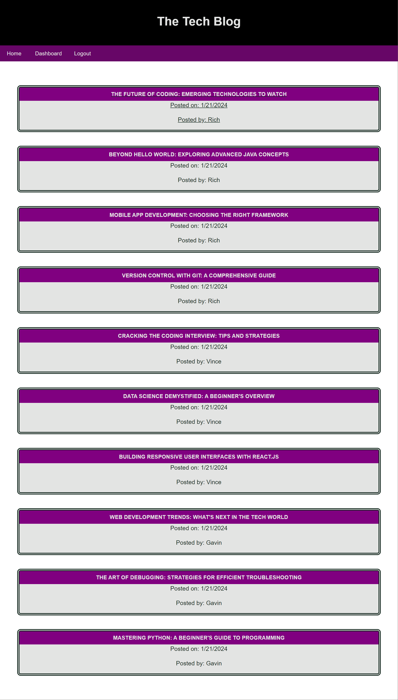

# Gavin's Tech Blog
<!-- Improved compatibility of back to top link: See: https://github.com/othneildrew/Best-README-Template/pull/73 -->
<div id="readme-top"></div>
<!--
*** Thanks for checking out the Best-README-Template. If you have a suggestion
*** that would make this better, please fork the repo and create a pull request
*** or simply open an issue with the tag "enhancement".
*** Don't forget to give the project a star!
*** Thanks again! Now go create something AMAZING! :D
-->


<!-- PROJECT SHIELDS -->
<!--
*** I'm using markdown "reference style" links for readability.
*** Reference links are enclosed in brackets [ ] instead of parentheses ( ).
*** See the bottom of this document for the declaration of the reference variables
*** for contributors-url, forks-url, etc. This is an optional, concise syntax you may use.
*** https://www.markdownguide.org/basic-syntax/#reference-style-links
-->
[![Contributors][contributors-shield]][contributors-url]
[![Forks][forks-shield]][forks-url]
[![Stargazers][stars-shield]][stars-url]
[![Issues][issues-shield]][issues-url]
[![MIT License][license-shield]][license-url]
[![LinkedIn][linkedin-shield]][linkedin-url]


<!-- PROJECT LOGO -->
<br />
<div align="center">
  <!-- <a href="https://github.com/gmeyer24/HW14-Model-View-Controller--MVC--Tech-Blog">
    
  </a> -->

<h3 align="center">Gavin's Tech Blog</h3>

  <p align="center">
    <br />
    <a href="https://github.com/gmeyer24/HW14-Model-View-Controller--MVC--Tech-Blog"><strong>Explore the docs »</strong></a>
    <br />
    <br />
    <a href="https://github.com/gmeyer24/HW14-Model-View-Controller--MVC--Tech-Blog">View Demo</a>
    ·
    <a href="https://github.com/gmeyer24/HW14-Model-View-Controller--MVC--Tech-Blog/issues">Report Bug</a>
    ·
    <a href="https://github.com/gmeyer24/HW14-Model-View-Controller--MVC--Tech-Blog/issues">Request Feature</a>
  </p>
</div>


<!-- TABLE OF CONTENTS -->
<details>
  <summary>Table of Contents</summary>
  <ol>
    <li>
      <a href="#about-the-project">About The Project</a>
      <ul>
        <li><a href="#built-with">Built With</a></li>
      </ul>
    </li>
    <li>
      <a href="#getting-started">Getting Started</a>
      <ul>
        <!-- <li><a href="#prerequisites">Prerequisites</a></li> -->
        <li><a href="#installation">Installation</a></li>
      </ul>
    </li>
    <li><a href="#usage">Usage</a></li>
    <!-- <li><a href="#roadmap">Roadmap</a></li> -->
    <li><a href="#contributing">Contributing</a></li>
    <!-- <li><a href="#license">License</a></li> -->
    <li><a href="#contact">Contact</a></li>
    <li><a href="#acknowledgments">Acknowledgments</a></li>
  </ol>
</details>


<!-- ABOUT THE PROJECT -->
## Description
<!-- Enter Description Below -->
The goal of this project was to build a CMS-style blog site similar to a Wordpress site. Developers can publish their blog posts and comment on other developers’ posts as well. The application follows the MVC paradigm in its architectural strcuture. It uses Handlebars.js as the templating language, Sequeliza as the ORM, and express-session npm package for authentication. 

[]()

<!-- Here's a blank template to get started: To avoid retyping too much info. Do a search and replace with your text editor for the following: `gmeyer24`, `HW14-Model-View-Controller--MVC--Tech-Blog`, `gavinpmeyer`, `gmail`, `gpmeyer24`, `HW14-Model-View-Controller--MVC--Tech-Blog`, `project_description` -->

<p align="right">(<a href="#readme-top">Back To Top</a>)</p>


### Built With

<!-- * [![Next][Next.js]][Next-url]
* [![React][React.js]][React-url]
* [![Vue][Vue.js]][Vue-url]
* [![Angular][Angular.io]][Angular-url]
* [![Svelte][Svelte.dev]][Svelte-url]
* [![Laravel][Laravel.com]][Laravel-url]
* [![Bootstrap][Bootstrap.com]][Bootstrap-url]
* [![JQuery][JQuery.com]][JQuery-url] -->
* [![JavaScript][JavaScript.com]][JavaScript-url]
* [![node.js][node.js.org]][node.js-url]
* [![Express.js][express.js.com]][express.js-url]
* [![Render][render.com]][render-url]

<p align="right">(<a href="#readme-top">Back To Top</a>)</p>


<!-- GETTING STARTED -->
## Getting Started

<!-- ### Prerequisites

This is an example of how to list things you need to use the software and how to install them.
* npm
  ```sh
  npm install npm@latest -g -->
  <!-- ``` -->

### Installation

1. Run 'npm install' in the command-line

<p align="right">(<a href="#readme-top">back to top</a>)</p>

<!-- USAGE EXAMPLES -->
## Usage

### Command-line Steps after Installation
1. Open the terminal
2. In the command-line enter 'nodemon server.js'

### Features of the Application
1. Create Account/Login

](assets/images/login.png)

2. View Post
    - Click on a post from the homepage to see the below, which includes the post with all it's content, a section to add a comment, and all the previous comments on this post.

    ](assets/images/viewPost.png)

3. Add Comment on Post
    - Write your comment in the text area on view post page and hit the Submit Comment button.

   ](assets/images/postComment.png)

4. View Your Posts Only
    - Click on the Dashboard tab on the nav bar.

    ](<assets/images/dashboard button.png>)

    - Your posts will display like the below.
    
    ](assets/images/dashboardView.png)

5. Create Post
    - Click on the Create Post button on this page and fill out the form. Once complete click on Create Post.

    ](assets/images/createPost.png)

6. Edit/Delete Post
    - Under the Dashboard view, click on the post you would like to edit or delete.
    - You can make any changes to the post. Once your changes are done, hit the Edit Post button.
    - To delete a post, simply click on the Delete Post button.

    ](assets/images/editPost.png)


<p align="right">(<a href="#readme-top">Back To Top</a>)</p>


<!-- ROADMAP -->
<!-- ## Roadmap

- [ ] Feature 1
- [ ] Feature 2
- [ ] Feature 3
    - [ ] Nested Feature

See the [open issues](https://github.com/gmeyer24/HW14-Model-View-Controller--MVC--Tech-Blog/issues) for a full list of proposed features (and known issues).

<p align="right">(<a href="#readme-top">Back To Top</a>)</p> -->


<!-- CONTRIBUTING -->
## Contributing

Contributions are what make the open source community such an amazing place to learn, inspire, and create. Any contributions you make are **greatly appreciated**.

If you have a suggestion that would make this better, please fork the repo and create a pull request. You can also simply open an issue with the tag "enhancement".
Don't forget to give the project a star! Thanks again!

1. Fork the Project
2. Create your Feature Branch (`git checkout -b feature/AmazingFeature`)
3. Commit your Changes (`git commit -m 'Add some AmazingFeature'`)
4. Push to the Branch (`git push origin feature/AmazingFeature`)
5. Open a Pull Request

<p align="right">(<a href="#readme-top">Back To Top</a>)</p>


<!-- LICENSE -->
<!-- ## License

Distributed under the MIT License. See `LICENSE.txt` for more information.

<p align="right">(<a href="#readme-top">Back To Top</a>)</p> -->


<!-- CONTACT -->
## Contact

Gavin Meyer | Email: gpmeyer24@gmail.com | GitHub: gmeyer24

Project Link: [GitHub Link](https://github.com/gmeyer24/HW14-Model-View-Controller--MVC--Tech-Blog)

Deployed Link: [Gavin's Tech Blog]()

<p align="right">(<a href="#readme-top">Back To Top</a>)</p>


<!-- ACKNOWLEDGMENTS -->
## Acknowledgments

* [W3Schools](https://www.w3schools.com/)
* Jose Lopez - Tutor
* ChatGPT
* Bootcamp Activities

<p align="right">(<a href="#readme-top">Back To Top</a>)</p>


<!-- MARKDOWN LINKS & IMAGES -->
<!-- https://www.markdownguide.org/basic-syntax/#reference-style-links -->
[contributors-shield]: https://img.shields.io/github/contributors/gmeyer24/HW14-Model-View-Controller--MVC--Tech-Blog.svg?style=for-the-badge
[contributors-url]: https://github.com/gmeyer24/HW14-Model-View-Controller--MVC--Tech-Blog/graphs/contributors
[forks-shield]: https://img.shields.io/github/forks/gmeyer24/HW14-Model-View-Controller--MVC--Tech-Blog.svg?style=for-the-badge
[forks-url]: https://github.com/gmeyer24/HW14-Model-View-Controller--MVC--Tech-Blog/network/members
[stars-shield]: https://img.shields.io/github/stars/gmeyer24/HW14-Model-View-Controller--MVC--Tech-Blog.svg?style=for-the-badge
[stars-url]: https://github.com/gmeyer24/HW14-Model-View-Controller--MVC--Tech-Blog/stargazers
[issues-shield]: https://img.shields.io/github/issues/gmeyer24/HW14-Model-View-Controller--MVC--Tech-Blog.svg?style=for-the-badge
[issues-url]: https://github.com/gmeyer24/HW14-Model-View-Controller--MVC--Tech-Blog/issues
[license-shield]: https://img.shields.io/github/license/gmeyer24/HW14-Model-View-Controller--MVC--Tech-Blog.svg?style=for-the-badge
[license-url]: https://github.com/gmeyer24/HW14-Model-View-Controller--MVC--Tech-Blog/blob/master/LICENSE.txt
[linkedin-shield]: https://img.shields.io/badge/-LinkedIn-black.svg?style=for-the-badge&logo=linkedin&colorB=555
[linkedin-url]: https://linkedin.com/in/gavinpmeyer
[product-screenshot]: images/screenshot.png
[Next.js]: https://img.shields.io/badge/next.js-000000?style=for-the-badge&logo=nextdotjs&logoColor=white
[Next-url]: https://nextjs.org/
[React.js]: https://img.shields.io/badge/React-20232A?style=for-the-badge&logo=react&logoColor=61DAFB
[React-url]: https://reactjs.org/
[Vue.js]: https://img.shields.io/badge/Vue.js-35495E?style=for-the-badge&logo=vuedotjs&logoColor=4FC08D
[Vue-url]: https://vuejs.org/
[Angular.io]: https://img.shields.io/badge/Angular-DD0031?style=for-the-badge&logo=angular&logoColor=white
[Angular-url]: https://angular.io/
[Svelte.dev]: https://img.shields.io/badge/Svelte-4A4A55?style=for-the-badge&logo=svelte&logoColor=FF3E00
[Svelte-url]: https://svelte.dev/
[Laravel.com]: https://img.shields.io/badge/Laravel-FF2D20?style=for-the-badge&logo=laravel&logoColor=white
[Laravel-url]: https://laravel.com
[Bootstrap.com]: https://img.shields.io/badge/Bootstrap-563D7C?style=for-the-badge&logo=bootstrap&logoColor=white
[Bootstrap-url]: https://getbootstrap.com
[JQuery.com]: https://img.shields.io/badge/jQuery-0769AD?style=for-the-badge&logo=jquery&logoColor=white
[JQuery-url]: https://jquery.com 
[JavaScript.com]: https://img.shields.io/badge/JavaScript-323330?style=for-the-badge&logo=javascript&logoColor=F7DF1E
[JavaScript-url]: https://www.javascript.com/
[node.js.org]: https://img.shields.io/badge/node.js-green.svg
[node.js-url]: https://nodejs.org/en
[express.js.com]: https://img.shields.io/badge/express.js-blue.svg
[express.js-url]: https://expressjs.com/
[render.com]: https://img.shields.io/badge/render-purple.svg
[render-url]: https://render.com/

